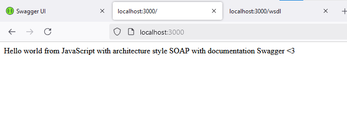
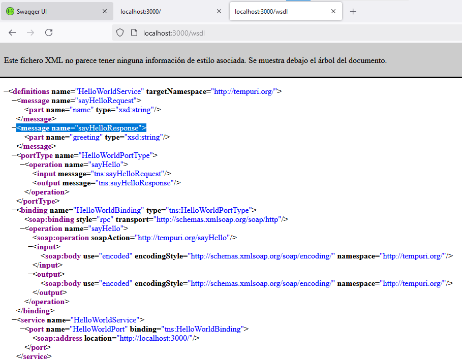
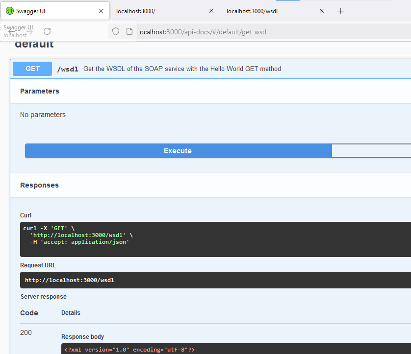

# EA2SOAP

This project implements a SOAP API with a "Hello World" service.

## Project Structure

- **server.js**: Main logic for the SOAP API server.
- **swagger.js**: Swagger documentation for the SOAP API.
- **hello_world.wsdl**: WSDL file describing the SOAP service.
- **swagger.json**: Swagger JSON definition for the API.
- **README.md**: Project documentation and instructions.

## Installation

1. Clone the repository:
     ```bash
    git clone https://github.com/meybili19/EA2SOAP.git
    ```

2. Install dependencies:
    ```bash
    npm install
    ```
    ```bash
    npm install express soap swagger-ui-express
    ```
3. Run the server:
    ```bash
    npm start
    ```

4. Access the documentation via Swagger UI:
    - Swagger UI: [http://localhost:3000/api-docs](http://localhost:3000/api-docs)
    - SOAP service: [http://localhost:3000/](http://localhost:3000/)

## WSDL Endpoint
You can access the WSDL of the service at:
[http://localhost:3000/wsdl](http://localhost:3000/wsdl)


## Example of ejecution







## Credits

This project was developed by Meybili Olivares (https://github.com/meybili19).
